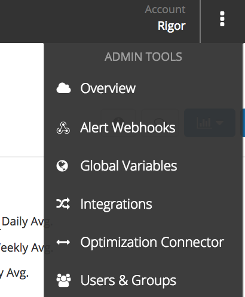
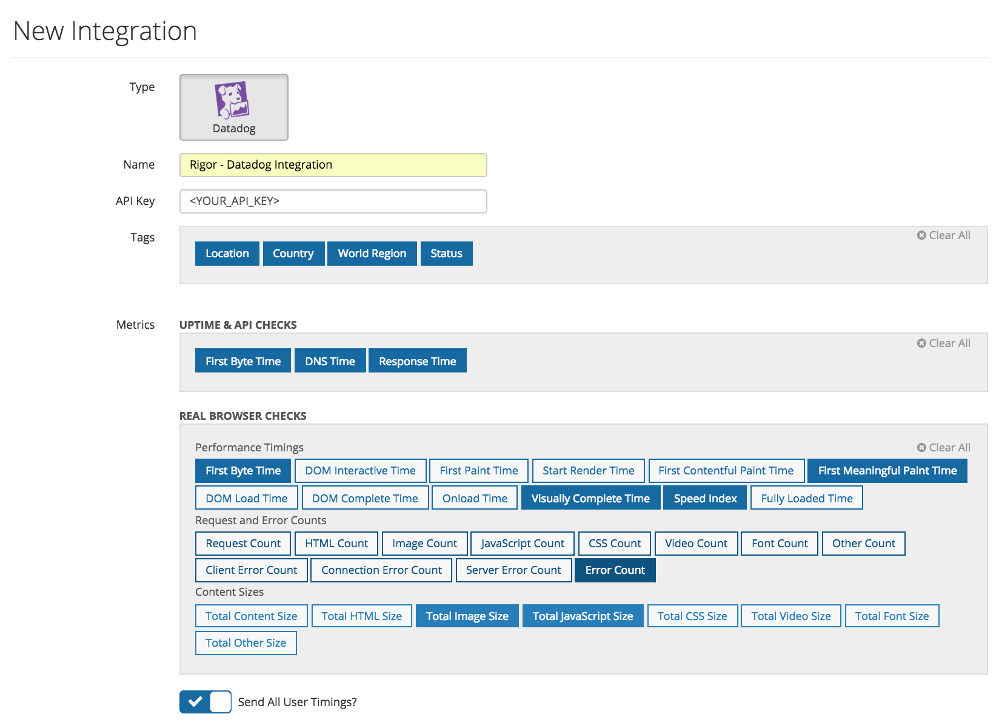
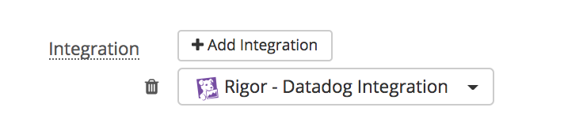

## Overview
Rigor provides synthetic monitoring and optimization insights throughout your development 
lifecycle.

With Rigor, you can collect synthetic, front-end performance metrics and push those 
metrics into Datadog.  You can also push alerts into Datadog as events.

## Setup

Rigor has two different integrations with Datadog, a metrics integration and an events 
integration.

### Configuring Metrics Integration
As an administrator, click the "Admin Tools" menu in the upper right hand of your 
screen and select "Integrations".

Add a new integration, by clicking the "New" button.  You will now be able to configure 
the integration.

Add a unique name for this integration and your API key from Datadog.  Then choose which 
tags and metrics you want to send. Some things to remember:
- we include a normalized version of the check name as a default tag
- for multi-step checks (Real Browser and API Checks), we include the position of the 
  request that the metrics came from
- Uptime checks include HTTP, Port, and API checks
- Port checks only report the "Response Time" metric

If you would like Real Browser Checks to report timings from the 
[User Timings API](https://developer.mozilla.org/en-US/docs/Web/API/User_Timing_API), 
make sure "Send All User Timings?" is selected.  Any marks are reported under the 
`rigor.real_browser.marks` namespace and measures are reported under the 
`rigor.real_browser.measures` namespace. Be aware that selecting this option
could send a lot of new series into Datadog, especially if the marks and measures
on the site you are testing are dynamically generated. 

Once you have configured the integration.  You can add to any Real Browser, HTTP, Port,
or API check.  Just edit the check and go to the "Notifications" tab.

### Configuring Events Integration

### Metrics
All of Rigor's metrics are pused to Datadog: First byte time; 	Request count;	Content size;
DOM interactive time;	HTML count;	HTML size;
First paint time;	Image count;	Image size;
First contentful paint time;	JavaScript count; JavaScript size; First meaningful paint time; CSS count; CSS size; Start render time; 	Video count; Video size; DOM load time; Font count;	Font size;DOM complete time;	Other count; Other size;
Onload time;	Client error count; Visually complete; Connection error count; Speed index;	Server error count; Fully loaded time; 	Error count

### Events
**NEED HELP HERE** @William - need your inupt here - not sure if we push system events, etc.

### Service Checks
**NEED HELP HERE** @William - not sure what this is?

### Troubleshooting
Need help? Contact [Rigor Support](mailto:support@rigor.com).

### Further Reading
Learn more about Rigor and how we can help make your website faster, visit [https://rigor.com](https://rigor.com).
