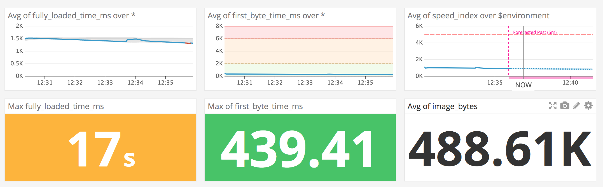

## Overview
Rigor provides synthetic monitoring and optimization insights throughout your development lifecycle.

## Setup
Setup via the "Integrations" menu, where you'll enter your Datadog API key, and you're done!

### Metrics
All of Rigor's metrics are pused to Datadog: First byte time; 	Request count;	Content size;
DOM interactive time;	HTML count;	HTML size;
First paint time;	Image count;	Image size;
First contentful paint time;	JavaScript count; JavaScript size; First meaningful paint time; CSS count; CSS size; Start render time; 	Video count; Video size; DOM load time; Font count;	Font size;DOM complete time;	Other count; Other size;
Onload time;	Client error count; Visually complete; Connection error count; Speed index;	Server error count; Fully loaded time; 	Error count

### Events
**NEED HELP HERE** @William - need your inupt here - not sure if we push system events, etc.

### Service Checks
**NEED HELP HERE** @William - not sure what this is?

### Troubleshooting
Need help? Contact [Rigor Support](mailto:support@rigor.com).

### Further Reading
Learn more about Rigor and how we can help make your website faster, visit [https://rigor.com](https://rigor.com).
