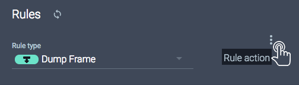
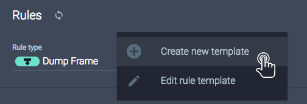
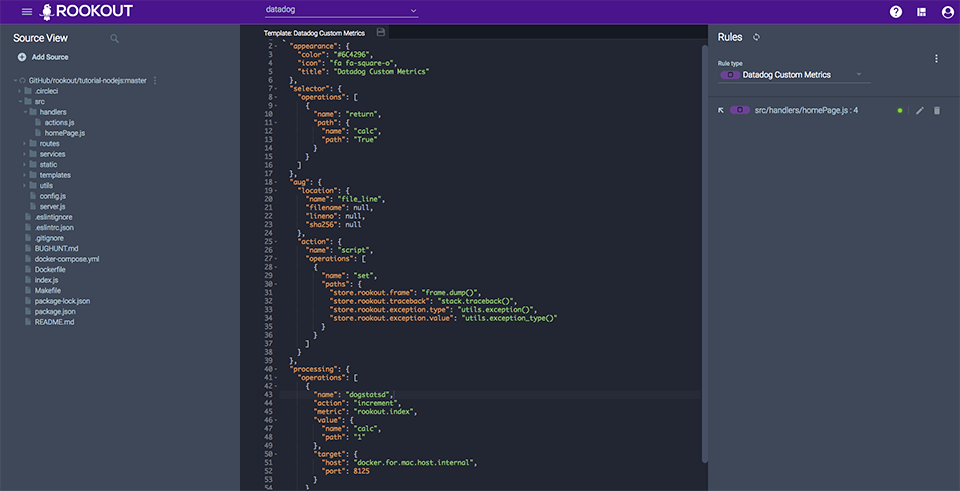
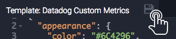

## Overview

Collect [custom metrics](https://docs.datadoghq.com/getting_started/custom_metrics/) from your application with a few clicks and send it to DataDog. No need to write code, redeploy or restart your app. [Start a free trial](https://www.rookout.com/trial).
* Enhance monitoring and expedite production debugging with Rookout’s on-demand data collection. 
* Have a new custom metric but you didn’t create the instrumentation to collect it? Not a problem. Rookout can collect custom metrics ad-hoc.
* Datadog Pro customers are allotted 100 custom metrics per host & Enterprise customers are allotted 200 custom metrics per host. More will incur billing charges.

## Setup
### Installation
Rookout sends data to Datadog via the DogstatsD service available from the Datadog agent.

1. Install the [Datadog agent](https://docs.datadoghq.com/agent/) and [Rookout](https://docs.rookout.com/docs/getting-started.html).

1. Log into [Rookout's webapp](https://app.rookout.com)

1. In the right panel (Rules) click on the menu button

    

1. Click on *Create new template* in order to edit a new rule template

    

1. Copy the Datadog Custom Metric rule template [available here](rule-template.json) into the editor and replace the default rule template.

    

1. Click the save icon to save the template

    

1. Add the newly created rule to any application as you would normally !

### Configuration

You can configure the rule to use specific actions, every rule should contain these attributes in the `processing.operations` object:

```json
{
    "name": "dogstatsd",
    "action": "<ACTION>",
    "metric": "<METRIC_NAME>",
    "target": {
      "host": "<HOST_NAME>",
      "port": 8125
    }
}
```

Depending on the actions, it needs different additional attributes:

| Datadog Action |    Attributes    |
|:--------------:|:-----------:|
|    increment   | value       |
|    decrement   | value       |
|      event     | title, text |
|      gauge     | value       |
|    histogram   | value       |
|     timing     | value       |
|  distribution  | value       |
For more information about these actions you can see [Dogstatsd documentation](https://docs.datadoghq.com/developers/dogstatsd/)

Any attribute must be formatted the following way to be accepted by our rule:

```json
"value": {
    "name": "calc",
    "path": "123"
}
```

```json
"value": {
    "name": "calc",
    "path": "\"string\""
}
```

## Data Collected
You can collect custom metrics and events by creating a Datadog output in your Rookout rule. Some commonly used patterns:
* Count the number of a times a method is invoked (increment)
* Document process started in DataDog (event)
* Record batch sizes (histogram)

## Troubleshooting
If you have any questions, contact us at support@rookout.com.

## Further Reading
Find out more at [https://docs.rookout.com/](https://docs.rookout.com/).
